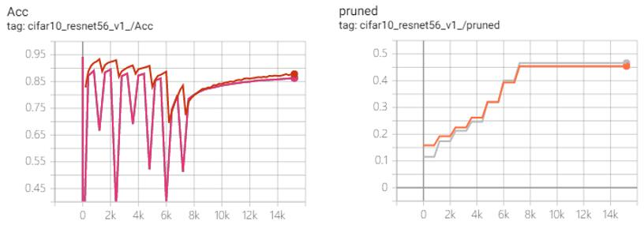
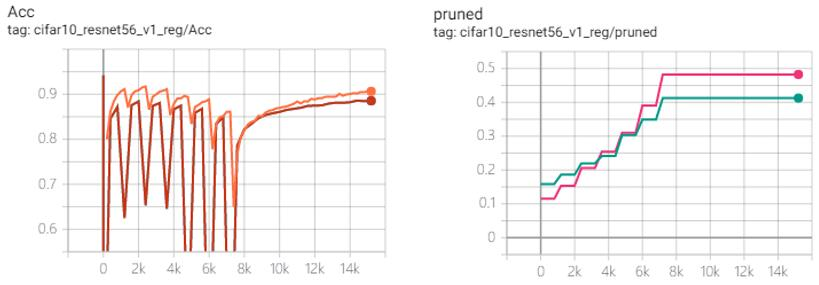

# Filter-Level Pruning

## Weight Rank Pruning

### L1 norm
Take the sensitivity(`std(weight) * s`) as threshold and prune the filters with small L1-norm.    

Test on `cifar10_resnet56_v1` model(top1-acc=93.6%).     
* Increasing `s`, without regularization         
    Prune at `step=[0, 1200, 2400, 3600, 4800, 6000, 7200]` with `s=[.4, .45, .5, .55, .6, .65, .7]`.    
        
    (top1-acc=86.32%, pruned_MAC=45.47%, pruned_params=46.63%)     
* Fixed `s`, with regularization    
    Prune at `step=[0, 1200, 2400, 3600, 4800, 6000, 7200]` with fixed `s=.4`.    
    But introduce group-lasso(`regularization = (weight ** 2).sum(axis=(1, 2, 3)).sqrt()`) to loss function.
         
    (top1-acc=88.54%, pruned_MAC=41.26%, pruned_params=48.24%)